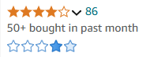

# Amazon Beta Stars Enhancer

Enhance your Amazon shopping experience with **Amazon Beta Stars Enhancer**, a browser extension that provides a more statistically robust representation of product ratings using the beta distribution.

## Why This Project Exists

Traditional 5-star rating systems can be misleading, especially when comparing products with vastly different numbers of reviews. This extension aims to offer a clearer, more reliable view of product quality by visualizing the confidence in average ratings based on the number of reviews.

## Features

- **Augmented Star Ratings:** Displays an additional set of blue stars beneath the original Amazon ratings.
- **Dynamic Display:** Works on both search result pages and individual product detail pages.
- **Statistical Insight:** The intensity of each blue star represents the probability derived from the beta distribution, offering a nuanced view of the rating's reliability.

## How to Use

1. **Install the Extension:**
   - Clone or download the repository.
   - Open Chrome and navigate to `chrome://extensions/`.
   - Enable "Developer mode" and click "Load unpacked."
   - Select the extension's directory.

2. **Navigate Amazon:**
   - Visit Amazon search results or any product detail page.
   - Observe the additional blue stars below the original ratings, indicating the statistical confidence of the ratings.

## Interpretation of Augmented Stars

- **Intensity Levels:** Each of the five blue stars' opacity corresponds to the probability that the true rating falls within that star's range based on the beta distribution.
- **Higher Intensity:** Indicates higher confidence in that rating bucket.
- **Balanced Distribution:** Helps in comparing products beyond just the average star rating by considering the volume of reviews.

## Disclaimer

*This is a toy project created for educational and demonstrative purposes. It is not affiliated with or endorsed by Amazon. Use it responsibly and at your own risk.*

## License

This project is licensed under the [MIT License](LICENSE).

**Special Condition:** You are free to use, modify, and distribute this project. However, if you monetize it or generate revenue based on it, please contact me to discuss compensation.

## Acknowledgments

- **jStat Library:** For providing the statistical tools necessary for beta distribution calculations.
- **Amazon:** For the platform and inspiration behind this extension.